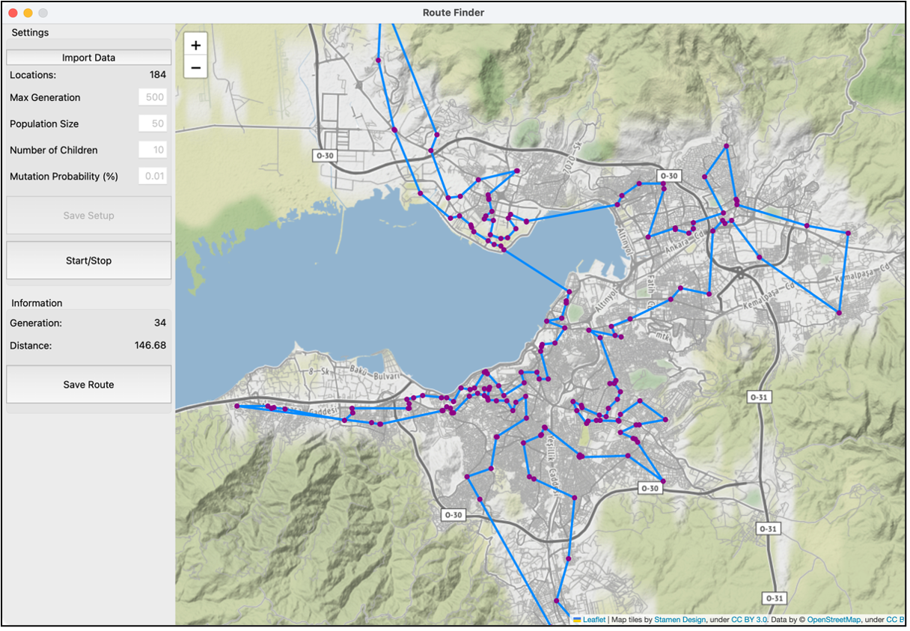

# route-finder - Genetic Algorithm Route Finder Application

**route-finder** is an open-source software with an easy-to-use interface that allows users to optimize the navigation of geographical locations with Genetic Algorithm based solution.

## Installation and Launching of route-finder

**Requirements**
```yaml
python (version >= 3.11)
```

**Installation**

Installation of all of the required packages
```bash
$ pip install -r requirements.txt
```

**Launching**

If you use terminal, go to src folder with **cd** command. Then open main.py with **python** command:
```bash
$ cd src
$ python main.py
```
If you use Visual Studio Code, run src/main.py file.

**Interface**



 # License

 - [MIT-License](LICENSE)
